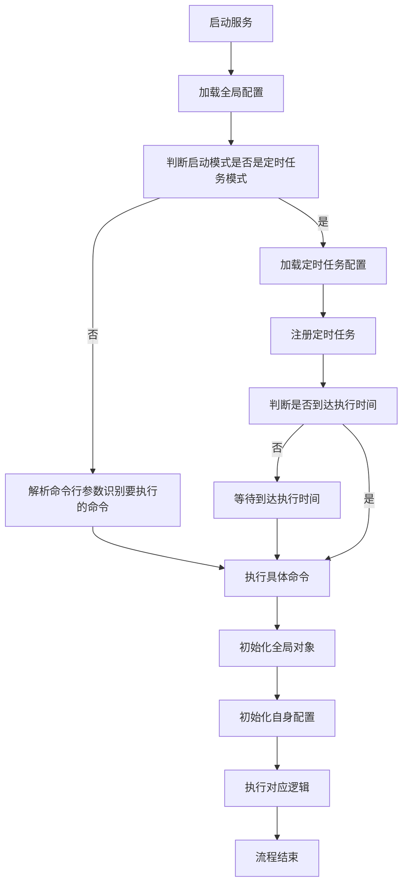

# 项目介绍
离线项目整体框架，提升离线项目的开发效率。

## 项目特点
+ 1、统一项目启动的日志初始化、数据库初始化、redis初始化工作，规范项目结构，提升开发效率。
+ 2、收敛数据层功能，提升不同离线项目功能的复用性，提升开发效率。
+ 3、支持各个项目拥有各自的配置，同时支持各个项目日志的隔离。
+ 4、收敛整个项目的定时任务配置，控制整个项目的定时任务执行。

## 层级介绍
application 框架整体应用对象

config 项目配置目录

controller 具体的功能目录

dao 数据操作层

entity 模型层

service 提供给controller层调用的业务逻辑处理层

## 项目流程图
